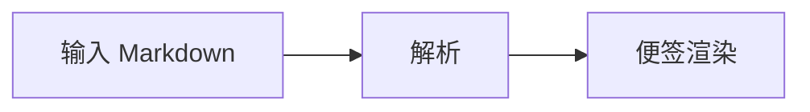

# Markdown 渲染测试

普通文字：中文、English、数字 123，以及标点「，。！？」
**粗体**、_斜体_、~~删除线~~、`行内代码`。
访问 [示例链接](https://example.com)，或查看自动识别的网址：https://example.com

---

## 列表与任务

- 第一项

* 第二项

- 第三项：这是一条比较长的内容，用来检查自动换行后，续行是否与正文对齐，而不是跑到项目符号下面。
  - 嵌套项目
    - 更深一层

* [ ] 未完成任务
* [x] 已完成任务

1. 有序列表第一项
2. 有序列表第二项
   1. 嵌套有序项目
3. 两位数序号

> 这是一段引用。
>
> - [ ] 引用中的任务
> - 引用中的普通列表

## 表格

| 功能     |     输入     | 期望显示 |
| :------- | :----------: | -------: |
| 粗体     |  `**文字**`  | **文字** |
| 行内代码 | `` `code` `` |   `code` |
| 中文     |  长内容测试  |   右对齐 |
| 特殊字符 |   `a \| b`   |   a \| b |

## 代码

行内代码：`const value = 42;`

```ts
type Task = { title: string; done: boolean };

const tasks: Task[] = [
  { title: "检查 Markdown", done: false },
  { title: "检查代码高亮", done: true },
];

console.log(tasks.filter((task) => !task.done));
```

```text
这里是纯文本代码块：
- [ ] 不应被渲染成任务
**不应变粗**
```

## LaTeX

行内公式：$E = mc^2$，以及 $a^2 + b^2 = c^2$。

独立公式：

$$
\int_0^1 x^2\,dx = \frac{1}{3}
$$

矩阵：

$$
A = \begin{bmatrix}
1 & 2 \\
3 & 4
\end{bmatrix}
$$

## 图片与图表




## 交互检查

点击这行文字的中间，检查光标是否落在点击位置。反复聚焦、失焦，并尝试勾选上面的任务；列表符号、任务框和正文应始终保持在同一行。

---
